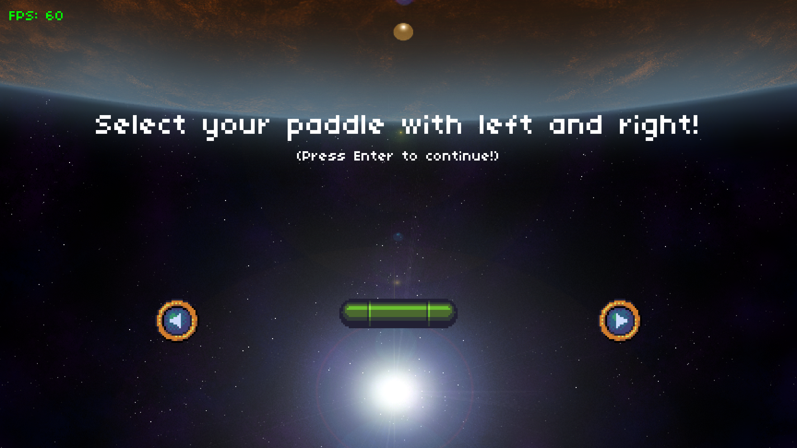
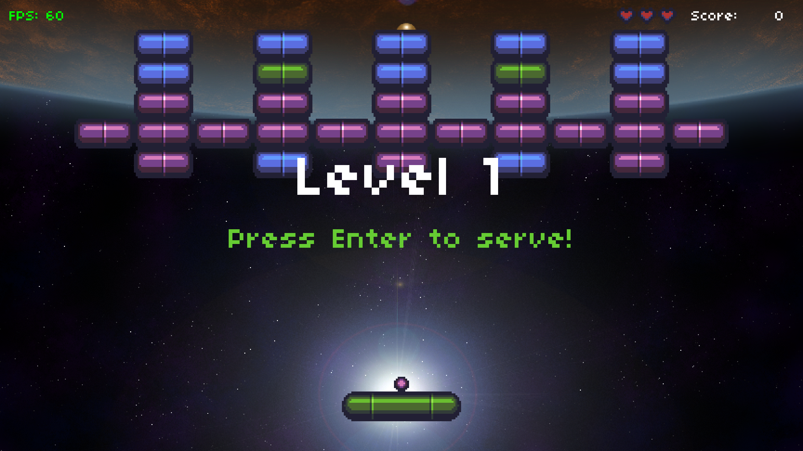
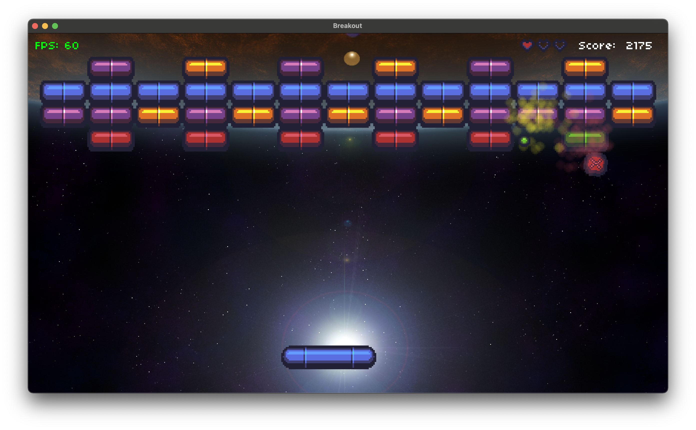
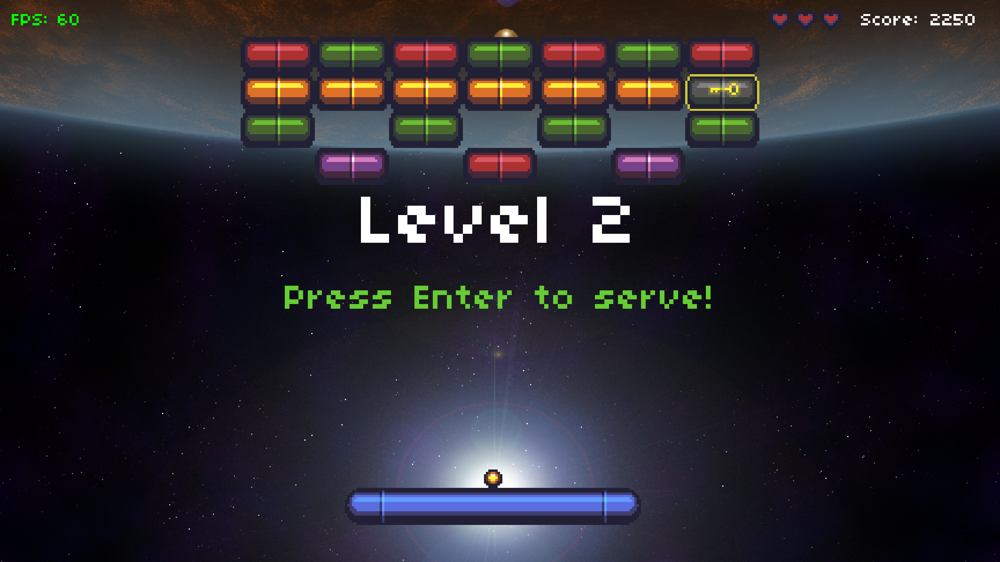
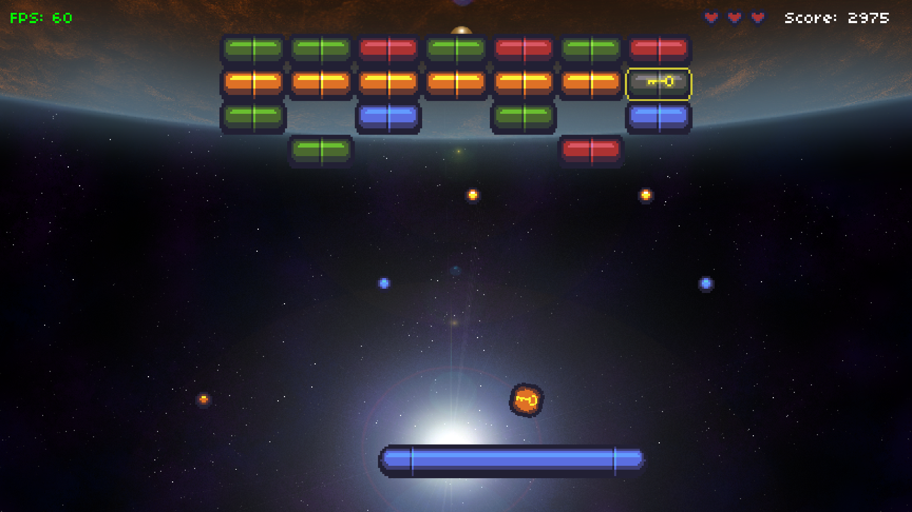
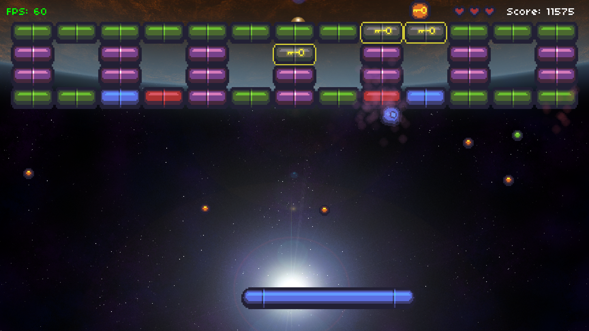
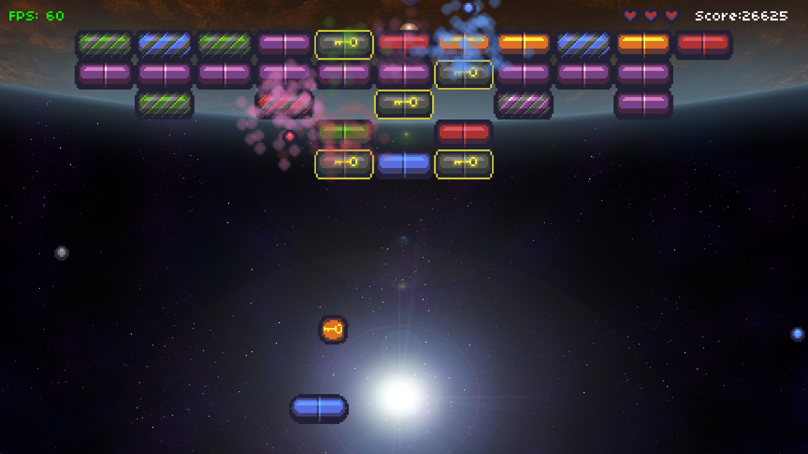

# Breakout

CS50G Breakout (Assignment #2)

Original code [by Colton Ogden](https://cs50.harvard.edu/games/2018/projects/2/breakout/)

Assignment:

1. ~~Add a powerup to the game that spawns two extra Balls.~~
2. ~~Grow and shrink the Paddle when the player gains enough points or loses a life.~~
3. ~~Add a locked Brick that will only open when the player collects a second new powerup, a key, which should only spawn when such a Brick exists and randomly as per the Ball powerup.~~

Added a few extra things (additional powerups mainly). See `Powerup.lua`.

# Playing

Keys:

* *space*: Pause game
* *left* and *right* arrows: Move paddle
* *m*: Pause or play music
* *escape*: Quit game

Debug keys: (note that `DEBUG_MODE` in `constants.lua` must be `true`)

* *x*: Spawn powerup, just above paddle
* *s*: Take screenshot (console will log file location)

# Screenshots

## Opening Screens

## Powerups

## Locked Bricks

## Paddle Sizes

# Bugs and Todos

* ~~Collision detection between powerups and the paddle is off, probably because I'm rotating the powerup as it falls but not taking that into account in the AABB collision detector. Particularly noticeable when the paddle is small.~~ (Fixed)
* I think the game generates too many lives, some games never seem to end.
* Balance in powerups isn't quite there -- maybe some (like paddle size) should have a timeout.
* If the player has a "key" powerup and then loses a life the key powerup is lost. Might be OK but hadn't deliberastely coded it that way.
* If the player quits before losing all lives no high score is recorded.
* It can be very frustrating when you're down to one brick and the ball consistently misses it. Tried to fix this by dropping powerups at random after `BORED_THRESHOLD` seconds.
* Speaking of frustration, the "increase paddle size" and "decrease paddle size" powerups look very similar...

# Credits

* Most of this code was written [by Colton Ogden](https://cs50.harvard.edu/games/2018/projects/2/breakout/) for the [CS50G EdX course](https://learning.edx.org/course/course-v1:HarvardX+CS50G+Games/home)
* Background image by [Bart Kelsey](https://opengameart.org/users/bart) via [Open Game Art](https://opengameart.org/content/red-planet-2)
* Music also by [Bart Kelsey](https://opengameart.org/users/bart) via [Open Game Art](https://opengameart.org/content/xeon-theme-remastered)
* Using [boon](https://github.com/camchenry/boon) to package releases
